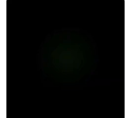
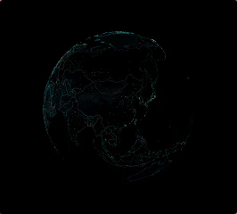

## 效果预览

<p align="center">
  
  
</p>
# Three Scope Map · Earth-to-China 3D Map Skill

A Codex skill for building an exact Three.js Earth entrance and reusable
multi-level 3D geographic maps for Vue / React web projects. The bundled default
experience starts in space, highlights a textured and extruded China on the
globe, then performs a coordinated 3D handoff into the existing China map and
continues through province, city, and district/county drilldown.

> **Original project notice:** This repository is the original public source of
> `three-scope-map-skill` by **宋夏天Dazzle**. Forks, derivative works,
> tutorials, public showcases, and redistributed versions must retain the
> original attribution and must not imply that modified versions are original
> or official releases by the original author.
>
> **原始项目声明：** 本仓库是 **宋夏天Dazzle** 发布的
> `three-scope-map-skill` 原始公开来源。任何 fork、二创、教程、
> 公开展示或再分发版本都必须保留原作者署名，不得暗示修改版是完全原创
> 或原作者官方发布。

This repository intentionally contains only the standalone Earth/3D map skill
and its runnable minimal Vue and React templates, not the full dashboard
project or any business-screen content.

## What It Supports

- A validated one-to-one Vue 3 template and an equivalent React 19 template, both opening directly on the Three.js Earth.
- Textured spherical Earth rendering with neutral starfield, atmosphere, geographic outlines, fine grid intersections, grid scan, and idle motion.
- A separately tessellated and extruded China surface with terrain texture, side-wall thickness, inner glow, animated contour light, and Taiwan wall handling.
- Persistent international fly-line tracks, synchronized moving light segments, and node ripple effects.
- A cloud/atmosphere dive and real 3D camera push from Earth into the existing China map.
- Province, country, city, district, and world map scopes.
- Real GeoJSON-driven Three.js 3D map geometry.
- Dark HUD/B-end visualization style.
- One-sentence theme changes through one shared primary color for both Earth and every 3D map scope.
- Terrain texture configuration: diffuse, height/displacement, normal, roughness.
- Labels, scatter points, ripple effects, fly lines, hover lift, HUD base ring, and outer-contour chase light.
- Hierarchical drilldown for every non-terminal scope: world -> country -> province -> city -> district.
- Data adapter pattern for local seed data, network fallback, cache, request de-duplication, and hover prefetch.
- GeoJSON preprocessing for smoother runtime rendering.
- Chunked map rebuild and Three.js resource disposal for reduced click jank.
- User camera angle save/reset with unified defaults and optional per-scope overrides.
- A fixed screen-space South China Sea inset for China scope and a separate spherical dashed representation on Earth.
- Template integrity, strict project checks, build validation, and browser visual regression guidance.

## Two Templates, One Core

`three-scope-map/assets/templates/smart-mine-vue/` and
`three-scope-map/assets/templates/smart-mine-react/` are both runnable,
one-to-one projects that render identically. They share the same
framework-agnostic rendering core under
`three-scope-map/assets/templates/map-core/` (`createEarthView`,
`createScopeMap`, `createEarthChinaMap`); each template only adds a thin
Vue or React component shell around those factory functions. The skill
resolves which template to use from the target project's `package.json`
(`react` dependency -> React, `vue` dependency -> Vue), and defaults to Vue
when there is no target project yet.

## Songsummer Earth-to-China Template

The bundled project is the visual and interaction baseline. Tell Codex to copy
it before adapting data or integrating it into another project:

```txt
Use three-scope-map and copy the bundled Songsummer Earth-to-China Vue template first. Keep EarthView.vue, EarthChinaMap.vue, ChinaMap.vue, mapTheme.ts, map data, and texture assets as one unit. Do not recreate or redesign the Earth or 3D map from scratch. Mount EarthChinaMap.vue as the default view, then run the project and verify the full Earth-to-China handoff in a browser.
```

For one-to-one output on any requested region, keep this sentence in your prompt:

```txt
Preserve the bundled Songsummer Earth and 3D map style one-to-one. Do not simplify, reinterpret, or replace its renderer, textures, geometry, motion, labels, fly lines, contour light, camera behavior, South China Sea treatment, or handoff. Only adapt approved GeoJSON, labels, texture scope, fly-line source/targets, drilldown registry, and camera presets.
```

The complete runnable templates are under:

```txt
three-scope-map/assets/templates/smart-mine-vue/src/
three-scope-map/assets/templates/smart-mine-react/src/
```

## Install

Copy the `three-scope-map` folder into your Codex skills directory:

```bash
cp -R three-scope-map ~/.codex/skills/
```

Or install it from this GitHub repository with the skill installer if your Codex environment supports GitHub skill installation.

Both bundled templates require Node.js `^20.19.0` or `>=22.12.0`. Their
dependency versions are locked for reproducible installation.

## Quick Start

```bash
cd three-scope-map/assets/templates/smart-mine-vue && npm install && npm run dev
cd three-scope-map/assets/templates/smart-mine-react && npm install && npm run dev
```

## Contributing

Core map logic (rendering, theme, data adapter, terrain material, types) has
a single source of truth: `three-scope-map/assets/templates/map-core/`. Only
edit code there, then re-sync both runnable templates:

```bash
python3 three-scope-map/scripts/sync_map_templates.py
```

Do not hand-edit the `core/` directories inside `smart-mine-vue/` or
`smart-mine-react/` — they are generated copies and will be overwritten by
the sync script.

## Example Prompts

### No Existing Project Prompt

Use this when the current folder is empty or is not yet a frontend project:

```txt
这是我要使用的 skill：
https://github.com/songsummer920-dazzle/three-scope-map-skill

请你自动完成全部操作，我不懂开发。

要求：
1. 先从这个 GitHub 链接安装或读取 three-scope-map skill。
2. 检查当前工作目录。
3. 如果当前目录不是前端项目，直接复制 skill 内置 assets/templates/smart-mine-vue 完整最小项目，不要重新生成一套相似实现。
4. 安装锁文件指定的依赖，并挂载 EarthChinaMap.vue 作为默认视图。
5. EarthView.vue、EarthChinaMap.vue、ChinaMap.vue、mapTheme.ts、GeoJSON 和纹理资源必须作为一个整体复制，不得从零重写或删减。
6. 页面打开后必须先显示真实 Three.js 地球，再点击中国进入现有中国 3D 地图。
7. 地球必须保留星空、真实纹理、中国立体高程与侧边厚度、网格交点、扫描光、国际飞线、常态涟漪、大气边缘光和云层下钻。
8. 中国 3D 地图必须保留挤出厚度、侧边渐变、地形纹理、外/内部边界、标签、hover 抬升、飞线、追光、HUD 底座环、视角保存/恢复和南海线框。
9. 使用共享主色 #E8FF4F；如果之后只给一句新颜色，必须仅修改 MAP_THEME_PRIMARY，并让地球与所有 3D 地图层级同步换色。
10. 除区县级外，每个地图层级都要支持下钻，默认链路为中国 -> 省 -> 市 -> 区县。
11. 地图组件填满父容器，不要把 .map-host 写死成 1920px x 1080px；如果需要 16:9，由外层容器控制。
12. 不要加入完整大屏、业务面板、图表、指标数据、个人路径、临时文件或预览地址。
13. 运行 scripts/verify_template_integrity.py，必须通过模板完整性检查。
14. 运行 scripts/check_three_map_project.py <项目目录> --strict，并修复所有非环境限制类 blocker。
15. 运行 npm run build，并通过 Vite dev server 做真实浏览器检查。
16. 浏览器验收必须覆盖：地球首屏、中国立体表面、台湾侧墙、球面南海虚线、网格扫描、国际飞线、地球到中国地图的 3D 衔接、各级下钻和返回上级。
17. 不要用截图、SVG、CSS 或 2D 平面 GeoJSON 替代 Three.js 地图；WebGL 真不可用时必须说明具体原因。
18. 完成后启动项目并告诉我本地访问地址；能自动判断的内容不要反复询问。
```

### Existing Project Prompt

Use this when the current folder is already an app or website:

```txt
这是我要使用的 skill：
https://github.com/songsummer920-dazzle/three-scope-map-skill

请你自动安装或读取这个 three-scope-map skill，并把 3D 地图能力接入当前项目。

我不懂开发，请你自动完成：
1. 检查当前项目技术栈和目录结构。
2. 如果缺少 three 或相关依赖，请安装。
3. 如果当前项目不是 Vue 项目，请根据现有技术栈给出最小适配实现。
4. 从 skill 内置模板复制 EarthView.vue、EarthChinaMap.vue、ChinaMap.vue、mapTheme.ts、地图数据和纹理资源，保持其实现一模一样。
5. 将 EarthChinaMap.vue 接入指定页面或容器，默认先显示地球，再下钻到现有中国 3D 地图。
6. 不得自由重画地球、重写地图材质、替换动画、删减纹理或用简化实现代替模板。
7. 保留地球星空、中国立体高程、网格扫描、国际飞线、涟漪、云层下钻，以及 3D 地图的厚度、纹理、标签、hover、飞线、追光、底座环和南海线框。
8. 使用共享主色 #E8FF4F；后续一句话换色时只修改 MAP_THEME_PRIMARY，让地球和 3D 地图统一换色。
9. 地图组件填满父容器，不要写死 1920px x 1080px；16:9 缩放由现有外层容器负责。
10. 除区县级外，每个层级都要支持下钻；地图数据加载、缓存和预取不能改变既有视觉样式。
11. 不要修改当前项目中与地图无关的面板、图表、业务数据和页面资源。
12. 运行 scripts/verify_template_integrity.py 和 scripts/check_three_map_project.py <项目目录> --strict，并修复所有 blocker。
13. 运行 npm run build，再通过 Vite dev server 做真实浏览器验收，覆盖地球首屏、3D 衔接、各级下钻和返回。
14. 不要用截图、SVG、CSS 或 2D 平面 GeoJSON 替代 Three.js 地图；WebGL 真不可用时必须说明具体原因。
15. 完成后运行项目并告诉我本地访问地址。
```

### Specific Task Prompts

```txt
Use three-scope-map to install the bundled Earth-to-China Vue template as-is, open directly on Earth, and preserve its full 3D handoff into the China map.
```

```txt
Use three-scope-map to build a dark HUD-style Three.js Zhejiang province map with city boundaries, labels, fly lines, hover lift, and chase light.
```

```txt
Use three-scope-map to switch this 3D map from Zhejiang to Jiangsu while keeping the same visual style.
```

```txt
Use three-scope-map to add China -> province -> city -> district drilldown and optimize click performance.
```

```txt
Use three-scope-map to change MAP_THEME_PRIMARY to #2AF7FF so the Earth and every 3D map scope derive one unified color system.
```

```txt
Use three-scope-map to add user camera angle save/reset controls with unified default and per-scope override support.
```


## Notes

- Confirm GeoJSON and texture data licenses before using them in commercial projects.
- Generated fallback textures are useful for development, but replace them with approved terrain assets when final accuracy matters.
- Performance improvements reduce main-thread jank but cannot guarantee zero stutter on every device.
- The template uses `world.earth-render.json` for Earth first paint while retaining the raw world data separately.
- Theme changes must not tint the neutral black starfield or replace the bundled texture/material hierarchy.
- The repository contains no full dashboard, mining-screen panels, business metrics, or private project data.

## License

This project is licensed under **GPL-3.0-or-later**. If you copy, modify, fork,
redistribute, publish a derivative skill, or package this code into another
project, keep the license and source attribution with your distribution.

Required files and notices to preserve:

- `LICENSE`
- `NOTICE`
- `CITATION.cff`
- Source-code attribution comments and SPDX headers
- Third-party GeoJSON or texture metadata and license notices

## Attribution / 二创署名

When using, modifying, redistributing, forking, publishing tutorials based on,
or creating derivative skills from this project, credit the original source:

```txt
Based on three-scope-map-skill by 宋夏天Dazzle.
作者全平台ID：宋夏天Dazzle
公众号：送你整个夏天
Original repository: https://github.com/songsummer920-dazzle/three-scope-map-skill
```

Do not remove `LICENSE`, `NOTICE`, `CITATION.cff`, code attribution comments, or
documentation attribution sections from modified versions. Do not imply that
forks, tutorials, packaged distributions, or derivative skills are official
releases by the original author unless you have explicit permission.

The attribution is intended for comments, metadata, README, documentation,
release notes, tutorial pages, or marketplace descriptions. It is not rendered
in generated UI unless explicitly requested.

## Attribution and Misrepresentation Notice / 署名与禁止误导声明

If you modify, fork, redistribute, publish tutorials based on, publicly
showcase, or create derivative skills/projects from this repository, you must
preserve the original author attribution and clearly mark your version as
modified from this project.

You must not remove `LICENSE`, `NOTICE`, `CITATION.cff`, README attribution
sections, SPDX headers, or source-code attribution comments.

You must not misrepresent the origin of this project, imply that a modified
version is your original work, or imply that a fork, derivative, tutorial,
packaged distribution, or derivative skill is an official release by the
original author without explicit permission.

Required attribution:

```txt
Based on three-scope-map-skill by 宋夏天Dazzle
作者全平台ID：宋夏天Dazzle
公众号：送你整个夏天
Original repository: https://github.com/songsummer920-dazzle/three-scope-map-skill
```

中文说明：

如果你基于本项目进行修改、二创、fork、分发、教程录制、公开展示、
插件/skill 发布或衍生项目发布，必须保留原作者署名，并明确标注
你的版本是基于本项目修改而来。

不得删除 `LICENSE`、`NOTICE`、`CITATION.cff`、README 署名说明、SPDX 头信息
或源码中的作者署名注释。

不得误导他人认为该项目或其二创版本是你的完全原创作品；未经明确许可，
不得暗示二创版本、教程、分发包或衍生 skill 是原作者官方发布。

必须保留署名：

```txt
基于 three-scope-map-skill 修改
作者全平台ID：宋夏天Dazzle
公众号：送你整个夏天
原始仓库：https://github.com/songsummer920-dazzle/three-scope-map-skill
```

## Citation

GitHub can read `CITATION.cff` and show citation metadata for this repository.
For papers, articles, tutorials, courseware, or public demos, cite the original
repository and author information above.
